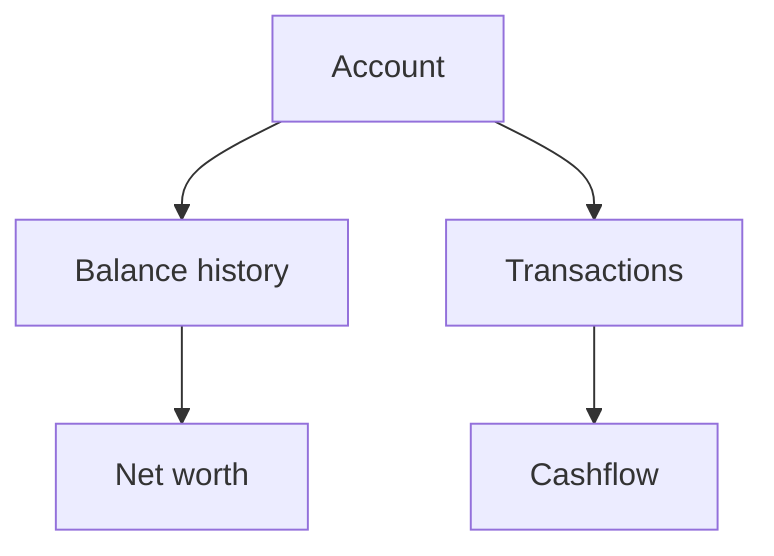

# Accounts

Accounts are the foundation of Whisper Money. They hold balances, transactions, and account history.

{{TOC}}

## Quick start

1. Create one account for each place where you keep or owe money.
2. Pick the account type that best matches the real account.
3. Add balances for accounts that are balance-only.
4. Import transactions for accounts that have day-to-day activity.
5. Review the Accounts page to see balances and net worth movement.

## Account map

## Account types

### Checking

Use this for everyday bank accounts.

Good for:

- Salary deposits
- Card payments
- Bill payments
- Daily spending

### Savings

Use this for cash you keep aside.

Good for:

- Emergency funds
- Short-term goals
- Money you do not spend daily

### Credit card

Use this for credit cards.

Credit card balances reduce net worth because they are money owed.

### Investment

Use this for broker or investment accounts.

These are usually balance-only accounts. You track value over time instead of daily transactions.

### Retirement

Use this for pension or retirement accounts.

Like investments, these usually focus on balance history and long-term growth.

### Loan

Use this for money you owe.

Examples:

- Mortgage
- Personal loan
- Student loan

Loan balances reduce net worth.

### Real estate

Use this for property value.

You can track market value and link a loan account when the property has a mortgage.

### Others

Use this when none of the other types fit.

Keep the name clear so you remember what the account represents.

## Transactional and balance-only accounts

Some accounts are best tracked with transactions. Others are best tracked with balances.

Use transactions for:

- Checking accounts
- Credit cards
- Savings accounts with regular movements

Use balances for:

- Investment accounts
- Retirement accounts
- Real estate
- Loans

## Balances, market values, and owed amounts

Whisper Money uses different words depending on the account type.

- Normal accounts use **balance**.
- Loan accounts use **owed amount**.
- Real estate accounts use **market value**.

This keeps the language closer to what the number means.

## Connected and manual accounts

You can track accounts manually or connect supported providers.

Manual accounts are good when:

- Your bank is not supported.
- You want full control.
- You only need occasional updates.

Connected accounts are good when:

- You want automatic transaction updates.
- You want less manual work.
- Your bank connection is available and healthy.

## FAQ

### Why is my loan reducing net worth?

A loan is money owed. Whisper Money subtracts it from assets when calculating net worth.

### Why does real estate use market value?

The important number for property is its estimated value today. That value can change over time.

### Should I create one account or combine several?

Create separate accounts when the money is stored separately in real life. Reports are clearer that way.
