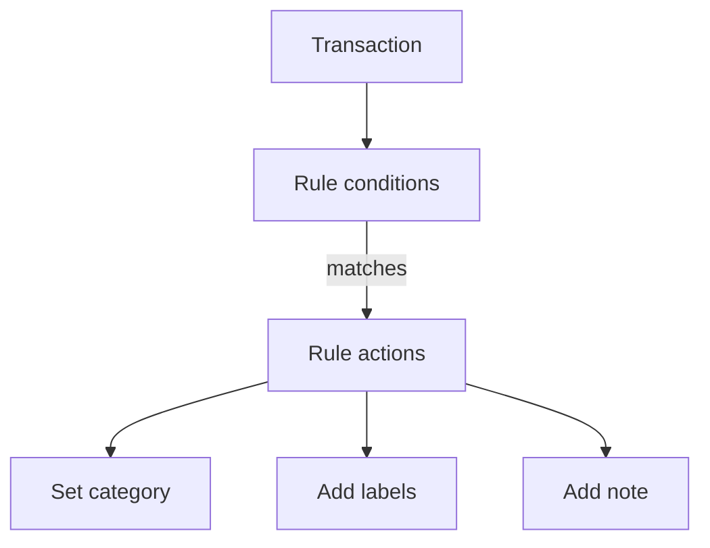

# Automation rules

Automation rules save time by updating matching transactions for you. They can set a category, add labels, and add a note.

{{TOC}}

## Quick start

1. Open Automation rules from settings or from the transaction tools.
2. Create a rule with one or more conditions.
3. Choose at least one action: category or labels.
4. Save the rule.
5. Apply it to existing transactions if you want old matches updated too.

## How rules work

Rules are checked by priority. The first matching rule can apply its actions.

## Conditions

Conditions decide whether a rule matches a transaction.

### Description

Match text from the bank description.

Good for merchants, subscriptions, and repeated payments.

### Amount

Match an exact amount or compare amounts.

Good for fixed subscriptions or recurring transfers.

### Bank name

Match transactions from a specific bank.

Good when the same merchant appears differently by bank.

### Account name

Match a specific account.

Good when one account needs special handling.

### Category

Match whether a category is empty, present, or equal to a value.

Good for cleaning uncategorized transactions.

## Actions

Actions are what the rule changes.

A rule can:

- Set a category.
- Add one or more labels.
- Add a note.

At least one category or label action is required.

## Groups and priority

Use groups when a rule needs more than one condition.

Examples:

- Description contains "Netflix" **and** amount is less than 20.
- Description contains "Uber" **or** description contains "Cabify".

Priority controls which rule wins when multiple rules could match.

Put specific rules before broad rules.

## Applying rules to existing transactions

Rules run when new plain transactions are created. Older transactions may need a manual apply step.

Use apply or re-evaluate when:

- You create a new rule.
- You change a rule.
- You imported old transactions.
- You want to clean a backlog.

## Important limitations

Automation needs readable transaction data.

Rules do not match encrypted descriptions because the server cannot read them. This protects your private data.

## FAQ

### Why did a rule not run?

Check the description, amount, account, and priority. Also check whether the transaction is encrypted.

### Should I create broad or specific rules?

Start specific. Broad rules are useful, but they can match too much.

### Can a rule add multiple labels?

Yes. A rule can add more than one label.
