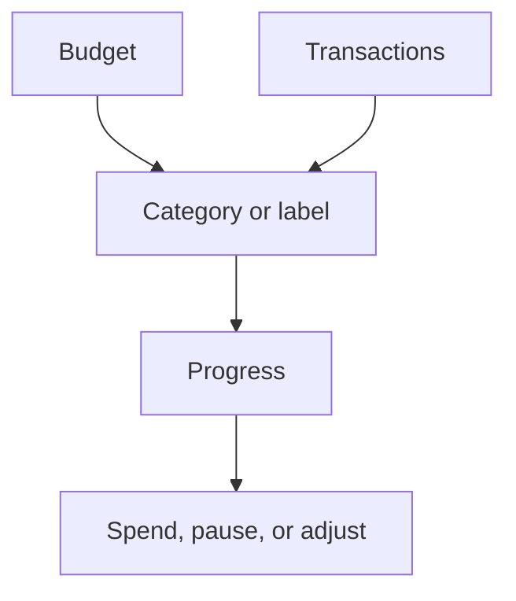

# Budgets

Budgets help you plan spending and see how much room is left in a period.

{{TOC}}

## Quick start

1. Create a budget for an area you want to control.
2. Pick the category or label it should track.
3. Set the amount for the period.
4. Review progress during the month.
5. Adjust the budget when your real spending changes.

## Budget flow

## What a budget tracks

A budget can track spending that matches a category or label.

Use a category when the spending has one clear meaning.

Use a label when the spending cuts across categories.

Example:

- Category budget: Groceries.
- Label budget: Vacation, Project, Business trip.

## Good budget examples

### Groceries

Good for everyday spending that happens often.

Review weekly.

### Restaurants

Good for optional spending that can grow quickly.

Review mid-month.

### Travel

Good for spending across many categories.

A label-based budget can work well here.

### Subscriptions

Good for repeated expenses.

Automation rules can help keep these categorized.

## Reading budget progress

Budget progress compares matched transactions with the budget amount.

If progress is high early in the period, slow down or increase the budget if the plan was too low.

If progress is low, the budget may be generous or the period may not be finished.

## Budget periods

Budgets are tracked by period. Most people think about budgets monthly.

When reviewing a budget, make sure you are looking at the right period.

## Common mistakes

- Budgeting before transactions are categorized.
- Creating too many budgets at once.
- Mixing one-time purchases with normal monthly spending.
- Forgetting that labels can be better for projects or trips.

## FAQ

### Do budgets change my transactions?

No. Budgets read transactions. They do not change them.

### Should every category have a budget?

No. Budget only what you want to actively control.

### Why does a budget look empty?

The matching transactions may be uncategorized, use a different label, or be in another period.
