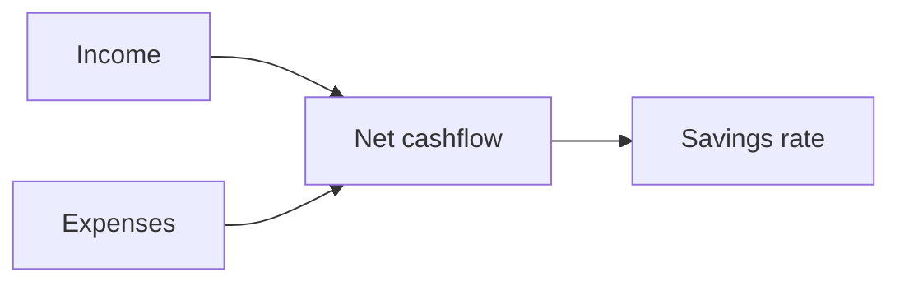

# Cashflow

Cashflow shows how money moves in and out during a period. It helps you understand whether you earned more than you spent.

{{TOC}}

## Quick start

1. Choose the month you want to review.
2. Check income and expense totals.
3. Look at net cashflow.
4. Review the money flow diagram.
5. Open income or expense breakdowns when something looks unusual.

## Cashflow formula



The basic formula is:

```text
Net cashflow = Income - Expenses
```

## Main cards

<div class="cards-wrapper">

<div class="card">
### Net cashflow

Shows what is left after expenses.

Positive is usually good. Negative means expenses were higher than income.

</div>

<div class="card">
### Savings rate

Shows the percentage of income left after expenses.

A higher rate means more income was kept.

</div>

<div class="card">
### Trend chart

Shows income, expenses, and net cashflow over recent months.

Use it to spot patterns.

</div>

<div class="card">
### Money flow

Shows where money came from and where it went.

Use it to understand the biggest flows quickly.

</div>
</div>

## Period navigation

The Cashflow page works by month.

Use period controls to move between months. The URL keeps the selected month, so you can refresh or share the same view.

## Income and expense breakdowns

Breakdowns show which categories make up income or spending.

Use them to answer questions like:

- Which category caused spending to increase?
- Was this month unusual?
- Which income source changed?
- Are uncategorized transactions affecting the result?

## Transfers in cashflow

Transfers are special.

Most transfers between your own accounts should not count as income or spending. If a transfer should appear in cashflow, set its cashflow direction on the category.

Options:

- Do not show.
- Show as cash inflow.
- Show as cash outflow.

## When cashflow looks wrong

Check these first:

1. Are transactions categorized correctly?
2. Are transfers using the right cashflow direction?
3. Are dates in the expected month?
4. Are imported amounts positive and negative the right way around?
5. Are there uncategorized transactions?

## FAQ

### Why is savings rate negative?

Expenses were higher than income for the selected period.

### Why are transfers missing?

Transfer categories are usually hidden from cashflow. Change cashflow direction if you want them shown.

### Why does the current month look incomplete?

The month may not be finished yet. Income or bills may still be missing.
