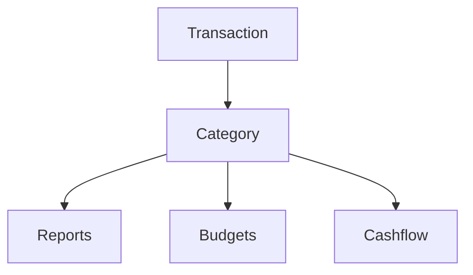

# Categories

Categories help Whisper Money understand each transaction. Pick the right category, and your reports become easier to trust.

{{TOC}}

## Quick start

If you only read one section, read this one.

1. **Choose what the transaction is.** Is it spending, income, saving, investing, or a transfer?
2. **Use transfers for money moving between your own accounts.** This keeps reports from counting the same money twice.
3. **Review uncategorized transactions often.** Reports are only useful when transactions have the right category.
4. **Create automation rules for repeated transactions.** Let Whisper Money handle future matches for you.

> Not sure what to pick? Start with the category type. The name can be adjusted later.

## Category map

Here is the basic idea:

A few examples:

- 🛒 **Groceries** → Expense → spending report and budgets.
- 💼 **Salary** → Income → income and cashflow reports.
- 🏦 **Checking to savings** → Transfer or Savings → cashflow stays accurate.
- 📈 **Broker deposit** → Investment → investing is separated from daily spending.

## What categories do

Every transaction can have one category.

Whisper Money uses that category to answer questions like:

- How much did I spend on food?
- How much income came in this month?
- Am I saving or investing regularly?
- Is this real spending, or did I move money between my own accounts?

## Category types

Each category has a type. The type tells Whisper Money how to treat the transaction.

### Expense

Money leaving your finances.

Examples:

- Groceries
- Rent
- Transport
- Subscriptions
- Taxes

### Income

Money coming into your finances.

Examples:

- Salary
- Freelance income
- Refunds
- Dividends
- Interest

### Transfer

Money moving between accounts you own.

Examples:

- Checking to savings
- Bank account to credit card
- Bank account to investment account

### Savings

Money intentionally set aside.

Examples:

- Emergency fund
- House deposit
- Vacation fund
- Other money goals

### Investment

Money going into assets or investment accounts.

Examples:

- Broker deposits
- Index funds
- Retirement contributions
- Crypto purchases
    

    

## Transfers and cashflow direction

Transfers can also have a cashflow direction.

Choose the option that best matches how you want the transfer to appear:

- **Do not show**: hide the transfer from cashflow.
- **Show as cash inflow**: show the transfer as money coming in.
- **Show as cash outflow**: show the transfer as money going out.

For most account-to-account movement, **Do not show** is the safest choice.

## Uncategorized transactions

Imported transactions may start without a category.

Try this routine:

1. Open uncategorized transactions.
2. Assign the obvious ones first.
3. Leave confusing ones for later if needed.
4. Create automation rules for repeated merchants or descriptions.

This keeps reports clean without turning categorization into a big chore.

## Changing a category

Changing a transaction category updates every report that includes that transaction.

This can change:

- Spending totals
- Budget progress
- Income totals
- Savings totals
- Investment totals
- Cashflow

Changing the category itself, such as its name or type, affects all transactions using that category.

## FAQ

### What if I choose the wrong category?

You can change it later. Reports update after the transaction is recategorized.

### Should credit card payments be expenses?

Usually no. If you already track the card purchases, the payment is money moving between your own accounts. Use a transfer category.

### How many categories should I create?

Start small. Too many categories make reports harder to read. Add more only when you need more detail.

### When should I create an automation rule?

Create one when the same merchant or description keeps getting the same category.

## Good category habits

- Keep names short and clear.
- Avoid duplicate categories for the same kind of spending.
- Use transfer categories for movement between your own accounts.
- Review uncategorized transactions before trusting monthly reports.
- Automate repeated merchants and descriptions.
