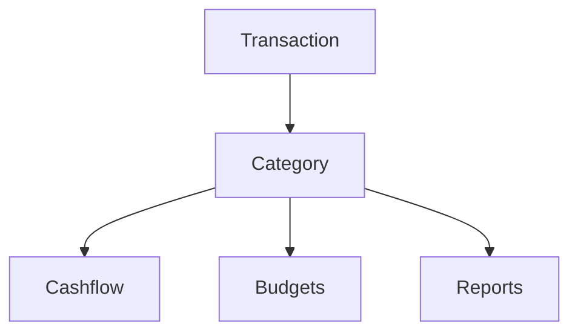

# Categories

Categories explain what each transaction means. Pick the right category and your reports become easier to trust.

{{TOC}}

## Quick start

1. Decide whether the transaction is income, expense, or transfer.
2. Use transfer categories for money moving between your own accounts.
3. Review uncategorized transactions often.
4. Create automation rules for repeated merchants.

> Not sure what to pick? Start with the type. You can rename the category later.

## Category map

Examples:

- Groceries → Expense → spending reports and budgets.
- Salary → Income → income and cashflow reports.
- Checking to savings → Transfer → avoids double-counting.

## Category types

Each category has one type.

### Expense

Use this for money leaving your finances.

Examples:

- Groceries
- Rent
- Transport
- Subscriptions
- Taxes

### Income

Use this for money coming into your finances.

Examples:

- Salary
- Freelance income
- Refunds
- Dividends
- Interest

### Transfer

Use this when money moves between accounts you own.

Examples:

- Checking to savings
- Bank account to credit card
- Bank account to investment account

## Transfers and cashflow direction

Transfer categories can be shown or hidden in cashflow.

Options:

- **Do not show**: hide the transfer from cashflow.
- **Show as cash inflow**: show the transfer as money coming in.
- **Show as cash outflow**: show the transfer as money going out.

For most account-to-account movement, **Do not show** is the safest choice.

## Uncategorized transactions

Imported or synced transactions may start without a category.

Try this routine:

1. Open uncategorized transactions.
2. Assign the obvious ones first.
3. Leave confusing ones for later if needed.
4. Create automation rules for repeated merchants or descriptions.

## Changing a category

Changing a transaction category updates reports that include that transaction.

This can affect:

- Spending totals
- Budget progress
- Income totals
- Cashflow

Changing the category itself, such as its name or type, affects all transactions using that category.

## FAQ

### What if I choose the wrong category?

You can change it later. Reports update after the transaction is recategorized.

### Should credit card payments be expenses?

Usually no. If you already track the card purchases, the payment is money moving between your own accounts. Use a transfer category.

### How many categories should I create?

Start small. Too many categories make reports harder to read. Add more only when you need more detail.

## Good category habits

- Keep names short and clear.
- Avoid duplicate categories for the same kind of spending.
- Use transfer categories for movement between your own accounts.
- Review uncategorized transactions before trusting monthly reports.
- Automate repeated merchants and descriptions.
