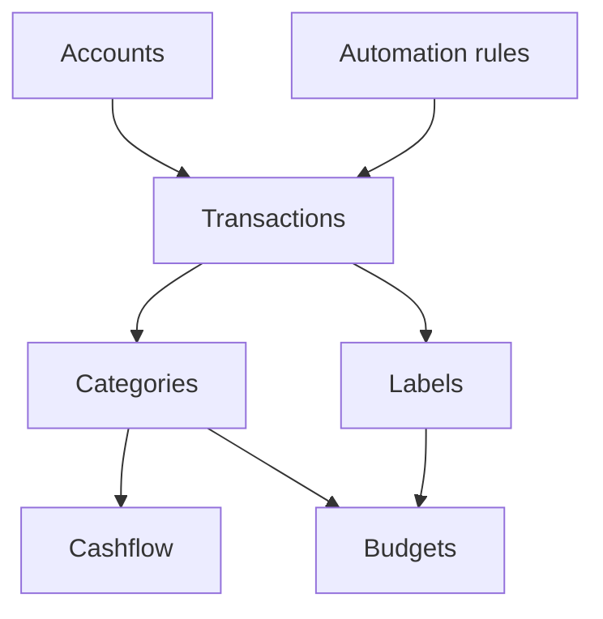

# Getting started

Whisper Money helps you understand where your money is, where it went, and what changed over time.

{{TOC}}

## Quick start

Follow this order if you are setting things up for the first time.

1. Create your accounts.
2. Add or import transactions.
3. Review uncategorized transactions.
4. Create automation rules for repeated transactions.
5. Check Cashflow to see income, expenses, and net movement.
6. Add budgets when you want spending limits.

## How the pieces fit together

## Main concepts

### Accounts

Accounts are where money lives.

Examples:

- Checking account
- Credit card
- Savings account
- Loan
- Real estate

### Transactions

Transactions are money movements.

Examples:

- Salary payment
- Grocery purchase
- Card payment
- Bank transfer

### Categories

Categories explain what a transaction means.

Examples:

- Groceries
- Salary
- Rent
- Transfer

### Automation rules

Rules save time by applying categories and labels for you.

Example:

- If description contains "Netflix", set category to "Subscriptions".

## Recommended weekly routine

A simple routine is enough for most people.

1. Import or sync new transactions.
2. Categorize anything uncategorized.
3. Fix transfers between your own accounts.
4. Check Cashflow for the month.
5. Review budgets if you use them.

## What to do when reports look wrong

Start with the basics.

- Check that the right accounts exist.
- Look for uncategorized transactions.
- Make sure transfers are not counted as income or spending.
- Check that dates are correct.
- Check whether a transaction belongs to a different currency account.

## FAQ

### Do I need budgets to use Whisper Money?

No. You can start with accounts, transactions, and categories. Add budgets later if you want limits.

### Should I categorize every transaction?

Yes, if you want accurate reports. Automation rules make this much faster.

### What should I set up first?

Start with accounts. Then add transactions. Categories and reports depend on those two things.
