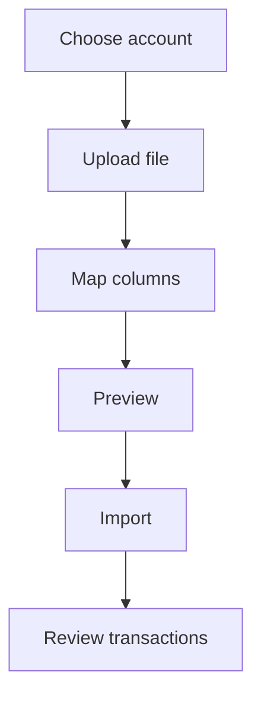

# Imports

Imports let you bring bank files into Whisper Money when automatic syncing is not available or when you want more control.

{{TOC}}

## Quick start

1. Choose the account.
2. Upload the bank file.
3. Map the columns.
4. Check the preview.
5. Import selected transactions.
6. Review categories and duplicates after import.

## Import flow

## Required columns

### Date

The transaction date.

Whisper Money can detect common date formats, but you can adjust it if needed.

### Description

The text that explains the transaction.

You can combine description columns when the bank splits details across fields.

### Amount

The transaction amount.

Make sure income and expenses use the correct sign.

### Balance

Optional.

Use this when the file includes running account balances.

## Balance calculation

Some files do not include a balance column.

When available, Whisper Money can calculate balances from transactions using a reference balance.

This is useful when:

- Your bank exports transactions but not balances.
- You know the latest balance.
- You want historical balance charts.

## Preview before importing

Always review the preview.

Look for:

- Wrong dates.
- Amounts with the wrong sign.
- Duplicate transactions.
- Missing descriptions.
- Unexpected empty rows.

## Automation during import

Automation rules can help categorize imported transactions.

This works best when descriptions are consistent. If imported rows come from the same bank file format every time, rules become very useful.

## FAQ

### Which file should I use?

Use the cleanest export your bank provides. CSV and spreadsheet-style files are usually easiest.

### Why are amounts reversed?

Some banks export expenses as positive numbers. Check the preview before importing.

### Can I import the same file twice?

Whisper Money tries to help identify duplicates, but review the preview to avoid importing the same transaction twice.
