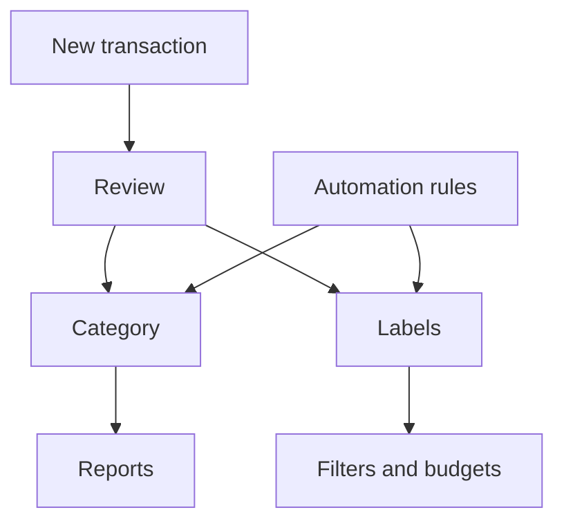

# Transactions

Transactions are the individual money movements in your accounts. They power categories, cashflow, budgets, and automation rules.

{{TOC}}

## Quick start

1. Add transactions manually, import them from a file, or sync them from a connected account.
2. Check dates, descriptions, and amounts.
3. Add categories and labels.
4. Use filters to find groups of transactions.
5. Use bulk actions when many transactions need the same update.

## Transaction flow

## What a transaction contains

### Date

The day the money moved.

Dates control which month the transaction appears in.

### Description

The text from your bank or the text you entered manually.

Descriptions are useful for search and automation rules.

### Amount

The money value.

Positive amounts usually mean money coming in. Negative amounts usually mean money going out.

### Category

The meaning of the transaction.

Categories decide where the transaction appears in reports.

### Labels

Extra tags you can use for filtering and budgets.

A transaction can have more than one label.

### Notes

Private context for yourself.

Use notes when the bank description is not enough.

## Filtering and search

Use filters when the list is too large.

You can filter by:

- Date range
- Amount range
- Category
- Account
- Label
- Search text

A good search often starts with the merchant name or a word from the bank description.

## Bulk actions

Bulk actions help when many transactions need the same change.

Good uses:

- Assign one category to several transactions.
- Add the same label to a group.
- Update notes for matching transactions.
- Re-evaluate automation rules for selected transactions.

Before bulk editing, double-check the filtered list. Bulk actions can update many rows at once.

## Uncategorized transactions

Uncategorized transactions make reports less useful.

Try this approach:

1. Filter for uncategorized transactions.
2. Categorize obvious merchants first.
3. Create automation rules for repeated merchants.
4. Leave unclear items for later instead of guessing.

## Re-evaluating automation rules

If you create or change rules after transactions already exist, older transactions may not update automatically.

Use re-evaluation when you want rules to run again on existing transactions.

Use it after:

- Creating a new rule.
- Fixing a rule condition.
- Importing many transactions.
- Cleaning up old uncategorized items.

## FAQ

### Why does a transaction show in the wrong month?

Check the transaction date. Reports use that date.

### Can one transaction have multiple categories?

No. A transaction has one category. Use labels when you need extra tags.

### What is the difference between categories and labels?

Categories define the main meaning. Labels add flexible tags for filtering and budgets.
