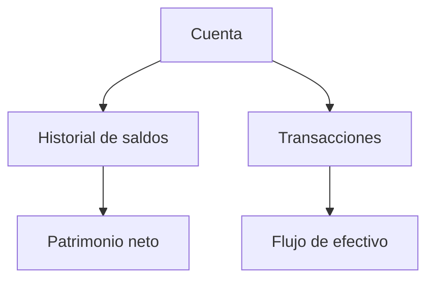

# Cuentas

Las cuentas son la base de Whisper Money. Guardan saldos, transacciones e historial.

{{TOC}}

## Inicio rápido

1. Crea una cuenta por cada lugar donde tienes o debes dinero.
2. Elige el tipo que mejor encaje con la cuenta real.
3. Añade saldos para cuentas que solo necesitan seguimiento de valor.
4. Importa transacciones para cuentas con actividad diaria.
5. Revisa la página de Cuentas para ver saldos y evolución del patrimonio neto.

## Mapa de cuentas

## Tipos de cuenta

### Corriente

Usa este tipo para cuentas bancarias del día a día.

Útil para:

- Ingresos de salario
- Pagos con tarjeta
- Facturas
- Gasto diario

### Ahorro

Usa este tipo para dinero que mantienes apartado.

Útil para:

- Fondo de emergencia
- Objetivos a corto plazo
- Dinero que no gastas a diario

### Tarjeta de crédito

Usa este tipo para tarjetas de crédito.

Los saldos de tarjeta reducen el patrimonio neto porque son dinero que debes.

### Inversión

Usa este tipo para cuentas de broker o inversión.

Normalmente son cuentas de solo saldo. Sigues su valor en el tiempo en vez de transacciones diarias.

### Jubilación

Usa este tipo para pensiones o cuentas de jubilación.

Como las inversiones, suelen centrarse en historial de saldo y crecimiento a largo plazo.

### Préstamo

Usa este tipo para dinero que debes.

Ejemplos:

- Hipoteca
- Préstamo personal
- Préstamo estudiantil

Los préstamos reducen el patrimonio neto.

### Inmueble

Usa este tipo para el valor de una propiedad.

Puedes seguir el valor de mercado y enlazar un préstamo cuando la propiedad tiene hipoteca.

### Otros

Usa este tipo cuando ningún otro encaje.

Mantén un nombre claro para recordar qué representa la cuenta.

## Cuentas transaccionales y cuentas de solo saldo

Algunas cuentas se siguen mejor con transacciones. Otras se siguen mejor con saldos.

Usa transacciones para:

- Cuentas corrientes
- Tarjetas de crédito
- Cuentas de ahorro con movimientos frecuentes

Usa saldos para:

- Cuentas de inversión
- Cuentas de jubilación
- Inmuebles
- Préstamos

## Saldos, valores de mercado e importes debidos

Whisper Money usa palabras distintas según el tipo de cuenta.

- Las cuentas normales usan **saldo**.
- Las cuentas de préstamo usan **importe debido**.
- Las cuentas de inmueble usan **valor de mercado**.

Así el lenguaje se acerca más a lo que significa el número.

## Cuentas conectadas y manuales

Puedes llevar cuentas manualmente o conectar proveedores compatibles.

Las cuentas manuales son útiles cuando:

- Tu banco no está soportado.
- Quieres control total.
- Solo necesitas actualizar de vez en cuando.

Las cuentas conectadas son útiles cuando:

- Quieres actualizaciones automáticas de transacciones.
- Quieres menos trabajo manual.
- La conexión bancaria está disponible y funciona bien.

## Preguntas frecuentes

### ¿Por qué mi préstamo reduce el patrimonio neto?

Un préstamo es dinero que debes. Whisper Money lo resta de tus activos al calcular el patrimonio neto.

### ¿Por qué los inmuebles usan valor de mercado?

El número importante de una propiedad es su valor estimado actual. Ese valor puede cambiar con el tiempo.

### ¿Debería crear una cuenta o combinar varias?

Crea cuentas separadas cuando el dinero esté separado en la vida real. Los informes serán más claros.
