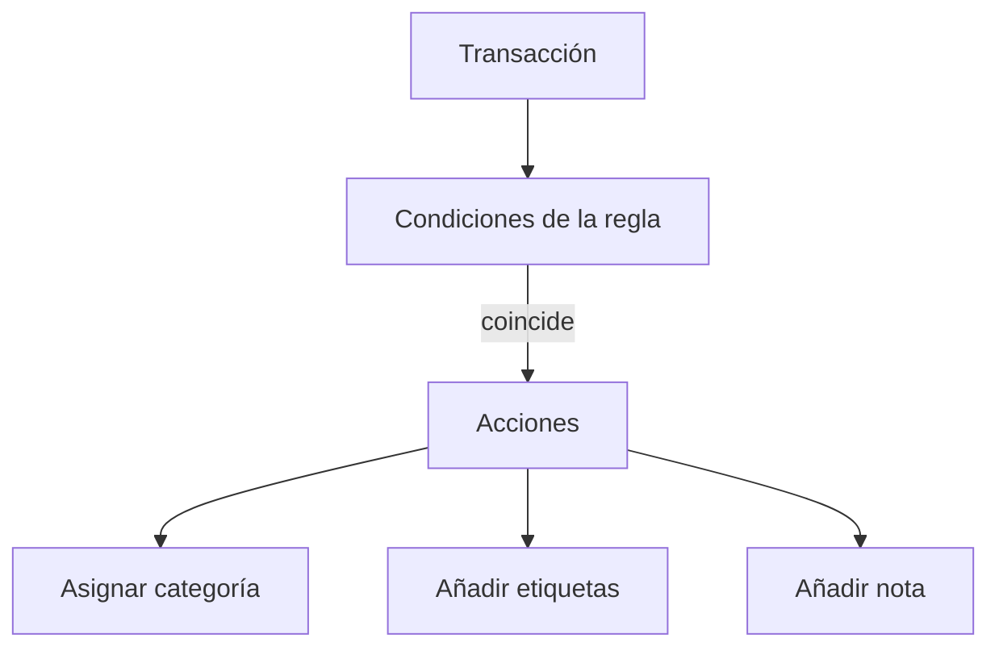

# Reglas de automatización

Las reglas de automatización ahorran tiempo actualizando transacciones coincidentes por ti. Pueden asignar una categoría, añadir etiquetas y añadir una nota.

{{TOC}}

## Inicio rápido

1. Abre Reglas de automatización desde ajustes o desde herramientas de transacciones.
2. Crea una regla con una o más condiciones.
3. Elige al menos una acción: categoría o etiquetas.
4. Guarda la regla.
5. Aplícala a transacciones existentes si quieres actualizar coincidencias antiguas.

## Cómo funcionan las reglas

Las reglas se revisan por prioridad. La primera regla que coincide puede aplicar sus acciones.

## Condiciones

Las condiciones deciden si una regla coincide con una transacción.

### Descripción

Coincide con texto de la descripción bancaria.

Útil para comercios, suscripciones y pagos repetidos.

### Importe

Coincide con un importe exacto o compara importes.

Útil para suscripciones fijas o transferencias recurrentes.

### Nombre del banco

Coincide con transacciones de un banco específico.

Útil cuando el mismo comercio aparece distinto según el banco.

### Nombre de la cuenta

Coincide con una cuenta específica.

Útil cuando una cuenta necesita tratamiento especial.

### Categoría

Coincide si una categoría está vacía, existe o es igual a un valor.

Útil para limpiar transacciones sin categoría.

## Acciones

Las acciones son lo que cambia la regla.

Una regla puede:

- Asignar una categoría.
- Añadir una o más etiquetas.
- Añadir una nota.

Hace falta al menos una acción de categoría o etiqueta.

## Grupos y prioridad

Usa grupos cuando una regla necesita más de una condición.

Ejemplos:

- La descripción contiene "Netflix" **y** el importe es menor que 20.
- La descripción contiene "Uber" **o** la descripción contiene "Cabify".

La prioridad controla qué regla gana cuando varias podrían coincidir.

Pon reglas específicas antes que reglas amplias.

## Aplicar reglas a transacciones existentes

Las reglas se ejecutan cuando se crean nuevas transacciones legibles. Las antiguas pueden necesitar un paso manual.

Usa aplicar o reevaluar cuando:

- Creas una regla nueva.
- Cambias una regla.
- Importaste transacciones antiguas.
- Quieres limpiar una acumulación de transacciones.

## Limitaciones importantes

La automatización necesita datos de transacción legibles.

Las reglas no coinciden con descripciones cifradas porque el servidor no puede leerlas. Esto protege tus datos privados.

## Preguntas frecuentes

### ¿Por qué no se ejecutó una regla?

Revisa la descripción, el importe, la cuenta y la prioridad. Comprueba también si la transacción está cifrada.

### ¿Debería crear reglas amplias o específicas?

Empieza con reglas específicas. Las reglas amplias son útiles, pero pueden coincidir con demasiado.

### ¿Una regla puede añadir varias etiquetas?

Sí. Una regla puede añadir más de una etiqueta.
