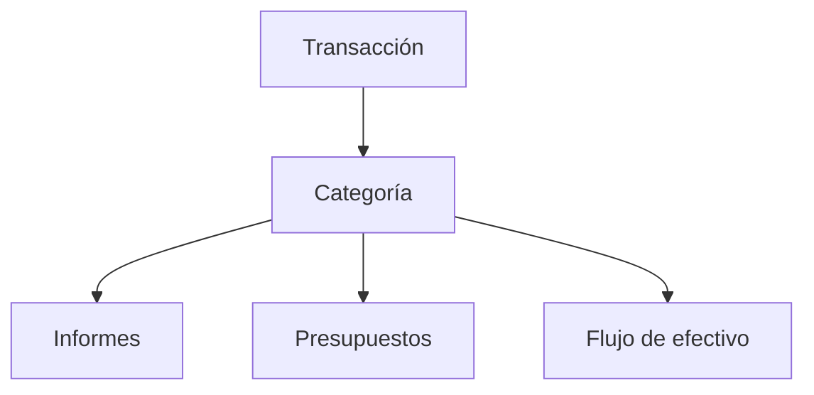

# Categorías

Las categorías ayudan a Whisper Money a entender cada transacción. Elige bien la categoría y tus informes serán más fáciles de confiar.

{{TOC}}

## Inicio rápido

Si solo lees una sección, lee esta.

1. **Elige qué es la transacción.** ¿Es gasto, ingreso, ahorro, inversión o transferencia?
2. **Usa transferencias para dinero que se mueve entre tus propias cuentas.** Así evitas contar el mismo dinero dos veces.
3. **Revisa las transacciones sin categoría a menudo.** Los informes solo son útiles cuando las transacciones tienen la categoría correcta.
4. **Crea reglas de automatización para transacciones repetidas.** Deja que Whisper Money gestione futuras coincidencias.

> ¿No sabes qué elegir? Empieza por el tipo de categoría. El nombre se puede ajustar después.

## Mapa de categorías

La idea básica es esta:

Algunos ejemplos:

- 🛒 **Supermercado** → Gasto → informe de gastos y presupuestos.
- 💼 **Salario** → Ingreso → informes de ingresos y flujo de efectivo.
- 🏦 **Cuenta corriente a ahorro** → Transferencia o Ahorro → el flujo de efectivo sigue siendo preciso.
- 📈 **Depósito en broker** → Inversión → la inversión queda separada del gasto diario.

## Qué hacen las categorías

Cada transacción puede tener una categoría.

Whisper Money usa esa categoría para responder preguntas como:

- ¿Cuánto gasté en comida?
- ¿Cuánto ingreso entró este mes?
- ¿Estoy ahorrando o invirtiendo con regularidad?
- ¿Esto es un gasto real o moví dinero entre mis propias cuentas?

## Tipos de categoría

Cada categoría tiene un tipo. El tipo le dice a Whisper Money cómo tratar la transacción.

### Gasto

Dinero que sale de tus finanzas.

Ejemplos:

- Supermercado
- Alquiler
- Transporte
- Suscripciones
- Impuestos

### Ingreso

Dinero que entra en tus finanzas.

Ejemplos:

- Salario
- Ingresos freelance
- Reembolsos
- Dividendos
- Intereses

### Transferencia

Dinero que se mueve entre cuentas tuyas.

Ejemplos:

- Cuenta corriente a ahorro
- Cuenta bancaria a tarjeta de crédito
- Cuenta bancaria a inversión

### Ahorro

Dinero que apartas intencionadamente.

Ejemplos:

- Fondo de emergencia
- Entrada para una casa
- Fondo de vacaciones
- Otros objetivos de dinero

### Inversión

Dinero que va a activos o cuentas de inversión.

Ejemplos:

- Depósitos en broker
- Fondos indexados
- Aportaciones para jubilación
- Compras de cripto
    

    

## Transferencias y dirección de flujo de efectivo

Las transferencias también pueden tener una dirección de flujo de efectivo.

Elige la opción que mejor encaje con cómo quieres que aparezca la transferencia:

- **No mostrar**: oculta la transferencia del flujo de efectivo.
- **Mostrar como entrada de efectivo**: muestra la transferencia como dinero que entra.
- **Mostrar como salida de efectivo**: muestra la transferencia como dinero que sale.

Para la mayoría de movimientos entre tus propias cuentas, **No mostrar** es la opción más segura.

## Transacciones sin categoría

Las transacciones importadas pueden empezar sin categoría.

Prueba esta rutina:

1. Abre las transacciones sin categoría.
2. Asigna primero las más obvias.
3. Deja las confusas para más tarde si hace falta.
4. Crea reglas de automatización para comercios o descripciones repetidas.

Así mantienes los informes limpios sin convertir la categorización en una tarea pesada.

## Cambiar una categoría

Cambiar la categoría de una transacción actualiza todos los informes que incluyen esa transacción.

Esto puede cambiar:

- Totales de gasto
- Progreso de presupuestos
- Totales de ingresos
- Totales de ahorro
- Totales de inversión
- Flujo de efectivo

Cambiar la categoría en sí, como su nombre o tipo, afecta a todas las transacciones que usan esa categoría.

## Preguntas frecuentes

### ¿Qué pasa si elijo la categoría equivocada?

Puedes cambiarla después. Los informes se actualizan cuando la transacción se recategoriza.

### ¿Los pagos de tarjeta de crédito deberían ser gastos?

Normalmente no. Si ya registras las compras de la tarjeta, el pago es dinero moviéndose entre tus propias cuentas. Usa una categoría de transferencia.

### ¿Cuántas categorías debería crear?

Empieza con pocas. Demasiadas categorías hacen que los informes sean más difíciles de leer. Añade más solo cuando necesites más detalle.

### ¿Cuándo debería crear una regla de automatización?

Crea una cuando el mismo comercio o descripción siempre acaba con la misma categoría.

## Buenos hábitos con categorías

- Usa nombres cortos y claros.
- Evita categorías duplicadas para el mismo tipo de gasto.
- Usa categorías de transferencia para movimientos entre tus propias cuentas.
- Revisa las transacciones sin categoría antes de confiar en los informes mensuales.
- Automatiza comercios y descripciones repetidas.
