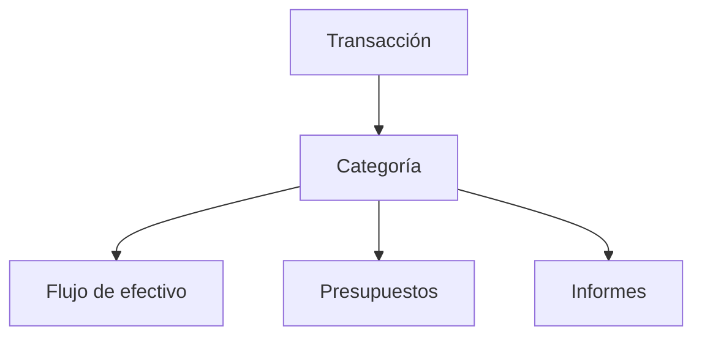

# Categorías

Las categorías explican qué significa cada transacción. Elige bien la categoría y tus informes serán más fáciles de confiar.

{{TOC}}

## Inicio rápido

1. Decide si la transacción es ingreso, gasto o transferencia.
2. Usa categorías de transferencia para dinero que se mueve entre tus propias cuentas.
3. Revisa las transacciones sin categoría a menudo.
4. Crea reglas de automatización para comercios repetidos.

> ¿No sabes qué elegir? Empieza por el tipo. Puedes cambiar el nombre de la categoría después.

## Mapa de categorías

Ejemplos:

- Supermercado → Gasto → informes de gasto y presupuestos.
- Salario → Ingreso → informes de ingresos y flujo de efectivo.
- Cuenta corriente a ahorro → Transferencia → evita contar dos veces.

## Tipos de categoría

Cada categoría tiene un tipo.

### Gasto

Usa este tipo para dinero que sale de tus finanzas.

Ejemplos:

- Supermercado
- Alquiler
- Transporte
- Suscripciones
- Impuestos

### Ingreso

Usa este tipo para dinero que entra en tus finanzas.

Ejemplos:

- Salario
- Ingresos freelance
- Reembolsos
- Dividendos
- Intereses

### Transferencia

Usa este tipo cuando el dinero se mueve entre cuentas que son tuyas.

Ejemplos:

- Cuenta corriente a ahorro
- Cuenta bancaria a tarjeta de crédito
- Cuenta bancaria a inversión

## Transferencias y dirección de flujo de efectivo

Las categorías de transferencia pueden mostrarse u ocultarse en flujo de efectivo.

Opciones:

- **No mostrar**: oculta la transferencia del flujo de efectivo.
- **Mostrar como entrada de efectivo**: muestra la transferencia como dinero que entra.
- **Mostrar como salida de efectivo**: muestra la transferencia como dinero que sale.

Para la mayoría de movimientos entre tus propias cuentas, **No mostrar** es la opción más segura.

## Transacciones sin categoría

Las transacciones importadas o sincronizadas pueden empezar sin categoría.

Prueba esta rutina:

1. Abre las transacciones sin categoría.
2. Asigna primero las más obvias.
3. Deja las confusas para más tarde si hace falta.
4. Crea reglas de automatización para comercios o descripciones repetidas.

## Cambiar una categoría

Cambiar la categoría de una transacción actualiza los informes que incluyen esa transacción.

Esto puede afectar:

- Totales de gasto
- Progreso de presupuestos
- Totales de ingresos
- Flujo de efectivo

Cambiar la categoría en sí, como su nombre o tipo, afecta a todas las transacciones que usan esa categoría.

## Preguntas frecuentes

### ¿Qué pasa si elijo la categoría equivocada?

Puedes cambiarla después. Los informes se actualizan cuando la transacción se recategoriza.

### ¿Los pagos de tarjeta de crédito deberían ser gastos?

Normalmente no. Si ya registras las compras de la tarjeta, el pago es dinero moviéndose entre tus propias cuentas. Usa una categoría de transferencia.

### ¿Cuántas categorías debería crear?

Empieza con pocas. Demasiadas categorías hacen que los informes sean más difíciles de leer. Añade más solo cuando necesites más detalle.

## Buenos hábitos con categorías

- Usa nombres cortos y claros.
- Evita categorías duplicadas para el mismo tipo de gasto.
- Usa categorías de transferencia para movimientos entre tus propias cuentas.
- Revisa las transacciones sin categoría antes de confiar en los informes mensuales.
- Automatiza comercios y descripciones repetidas.
