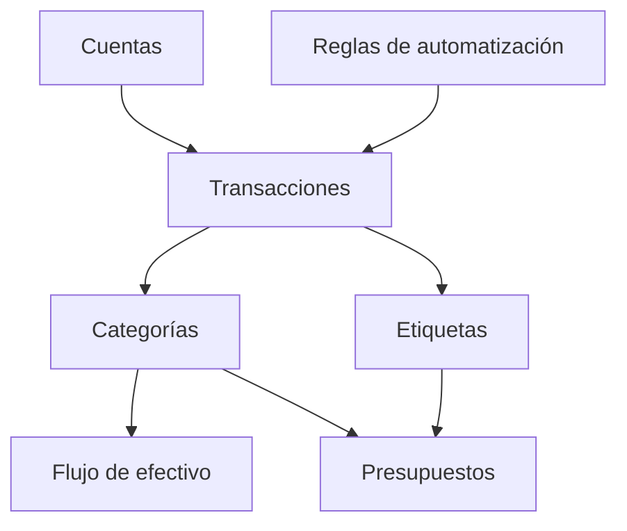

# Primeros pasos

Whisper Money te ayuda a entender dónde está tu dinero, dónde se fue y qué cambió con el tiempo.

{{TOC}}

## Inicio rápido

Sigue este orden si estás configurando todo por primera vez.

1. Crea tus cuentas.
2. Añade o importa transacciones.
3. Revisa las transacciones sin categoría.
4. Crea reglas de automatización para transacciones repetidas.
5. Revisa Flujo de efectivo para ver ingresos, gastos y movimiento neto.
6. Añade presupuestos cuando quieras límites de gasto.

## Cómo encajan las piezas

## Conceptos principales

### Cuentas

Las cuentas son donde vive el dinero.

Ejemplos:

- Cuenta corriente
- Tarjeta de crédito
- Cuenta de ahorro
- Préstamo
- Inmueble

### Transacciones

Las transacciones son movimientos de dinero.

Ejemplos:

- Pago de salario
- Compra en supermercado
- Pago de tarjeta
- Transferencia bancaria

### Categorías

Las categorías explican qué significa una transacción.

Ejemplos:

- Supermercado
- Salario
- Alquiler
- Transferencia

### Reglas de automatización

Las reglas ahorran tiempo aplicando categorías y etiquetas por ti.

Ejemplo:

- Si la descripción contiene "Netflix", usar categoría "Suscripciones".

## Rutina semanal recomendada

Una rutina simple es suficiente para la mayoría de personas.

1. Importa o sincroniza nuevas transacciones.
2. Categoriza lo que esté sin categoría.
3. Corrige transferencias entre tus propias cuentas.
4. Revisa Flujo de efectivo del mes.
5. Revisa presupuestos si los usas.

## Qué hacer si los informes parecen incorrectos

Empieza por lo básico.

- Comprueba que existen las cuentas correctas.
- Busca transacciones sin categoría.
- Asegúrate de que las transferencias no cuentan como ingreso o gasto.
- Revisa que las fechas sean correctas.
- Comprueba si una transacción pertenece a una cuenta en otra moneda.

## Preguntas frecuentes

### ¿Necesito presupuestos para usar Whisper Money?

No. Puedes empezar con cuentas, transacciones y categorías. Añade presupuestos después si quieres límites.

### ¿Debería categorizar todas las transacciones?

Sí, si quieres informes precisos. Las reglas de automatización lo hacen mucho más rápido.

### ¿Qué debería configurar primero?

Empieza por las cuentas. Después añade transacciones. Las categorías y los informes dependen de esas dos cosas.
