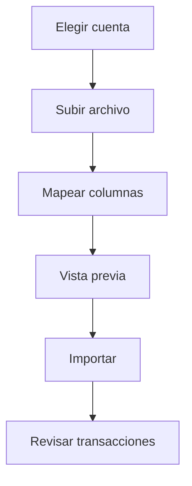

# Importaciones

Las importaciones te permiten traer archivos bancarios a Whisper Money cuando la sincronización automática no está disponible o cuando quieres más control.

{{TOC}}

## Inicio rápido

1. Elige la cuenta.
2. Sube el archivo del banco.
3. Mapea las columnas.
4. Revisa la vista previa.
5. Importa las transacciones seleccionadas.
6. Revisa categorías y duplicados después de importar.

## Flujo de importación

## Columnas necesarias

### Fecha

La fecha de la transacción.

Whisper Money puede detectar formatos comunes, pero puedes ajustarlo si hace falta.

### Descripción

El texto que explica la transacción.

Puedes combinar columnas de descripción cuando el banco separa detalles en varios campos.

### Importe

El importe de la transacción.

Asegúrate de que ingresos y gastos usan el signo correcto.

### Saldo

Opcional.

Úsalo cuando el archivo incluye saldos de cuenta acumulados.

## Cálculo de saldos

Algunos archivos no incluyen una columna de saldo.

Cuando es posible, Whisper Money puede calcular saldos desde transacciones usando un saldo de referencia.

Esto es útil cuando:

- Tu banco exporta transacciones pero no saldos.
- Conoces el saldo más reciente.
- Quieres gráficos de saldo histórico.

## Vista previa antes de importar

Revisa siempre la vista previa.

Busca:

- Fechas incorrectas.
- Importes con el signo equivocado.
- Transacciones duplicadas.
- Descripciones vacías.
- Filas vacías inesperadas.

## Automatización durante la importación

Las reglas de automatización pueden ayudar a categorizar transacciones importadas.

Funciona mejor cuando las descripciones son consistentes. Si siempre importas el mismo formato de archivo bancario, las reglas son muy útiles.

## Preguntas frecuentes

### ¿Qué archivo debería usar?

Usa la exportación más limpia que ofrezca tu banco. CSV y archivos tipo hoja de cálculo suelen ser los más fáciles.

### ¿Por qué los importes están invertidos?

Algunos bancos exportan gastos como números positivos. Revisa la vista previa antes de importar.

### ¿Puedo importar el mismo archivo dos veces?

Whisper Money intenta ayudar a detectar duplicados, pero revisa la vista previa para evitar importar la misma transacción dos veces.
