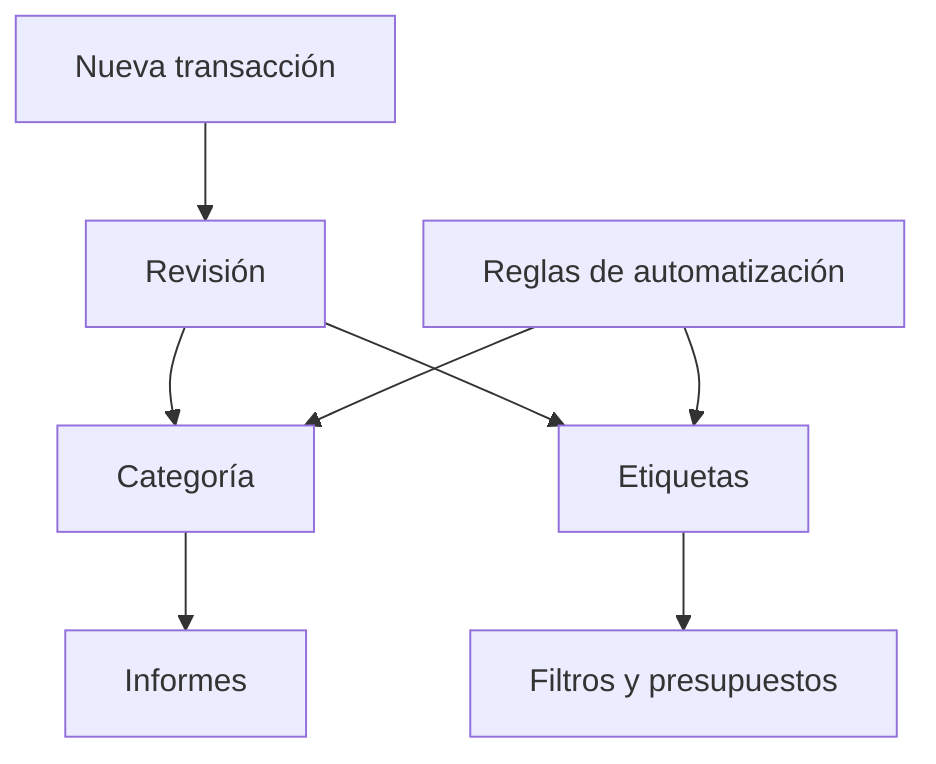

# Transacciones

Las transacciones son los movimientos individuales de dinero en tus cuentas. Alimentan categorías, flujo de efectivo, presupuestos y reglas de automatización.

{{TOC}}

## Inicio rápido

1. Añade transacciones manualmente, impórtalas desde un archivo o sincronízalas desde una cuenta conectada.
2. Revisa fechas, descripciones e importes.
3. Añade categorías y etiquetas.
4. Usa filtros para encontrar grupos de transacciones.
5. Usa acciones masivas cuando muchas transacciones necesitan el mismo cambio.

## Flujo de una transacción

## Qué contiene una transacción

### Fecha

El día en que se movió el dinero.

La fecha controla en qué mes aparece la transacción.

### Descripción

El texto de tu banco o el texto que escribiste manualmente.

Las descripciones son útiles para búsqueda y reglas de automatización.

### Importe

El valor del movimiento.

Los importes positivos suelen ser dinero que entra. Los negativos suelen ser dinero que sale.

### Categoría

El significado de la transacción.

Las categorías deciden dónde aparece la transacción en los informes.

### Etiquetas

Tags extra para filtrar y presupuestar.

Una transacción puede tener más de una etiqueta.

### Notas

Contexto privado para ti.

Usa notas cuando la descripción del banco no sea suficiente.

## Filtros y búsqueda

Usa filtros cuando la lista sea demasiado grande.

Puedes filtrar por:

- Rango de fechas
- Rango de importes
- Categoría
- Cuenta
- Etiqueta
- Texto de búsqueda

Una buena búsqueda suele empezar con el nombre del comercio o una palabra de la descripción bancaria.

## Acciones masivas

Las acciones masivas ayudan cuando muchas transacciones necesitan el mismo cambio.

Buenos usos:

- Asignar una categoría a varias transacciones.
- Añadir la misma etiqueta a un grupo.
- Actualizar notas para transacciones coincidentes.
- Reevaluar reglas de automatización en transacciones seleccionadas.

Antes de editar en masa, revisa bien la lista filtrada. Las acciones masivas pueden actualizar muchas filas a la vez.

## Transacciones sin categoría

Las transacciones sin categoría hacen que los informes sean menos útiles.

Prueba este enfoque:

1. Filtra transacciones sin categoría.
2. Categoriza primero los comercios obvios.
3. Crea reglas de automatización para comercios repetidos.
4. Deja los casos poco claros para más tarde en vez de adivinar.

## Reevaluar reglas de automatización

Si creas o cambias reglas después de que existan transacciones, las antiguas pueden no actualizarse automáticamente.

Usa la reevaluación cuando quieras que las reglas vuelvan a ejecutarse sobre transacciones existentes.

Úsala después de:

- Crear una regla nueva.
- Corregir una condición.
- Importar muchas transacciones.
- Limpiar transacciones antiguas sin categoría.

## Preguntas frecuentes

### ¿Por qué una transacción aparece en el mes equivocado?

Revisa la fecha de la transacción. Los informes usan esa fecha.

### ¿Una transacción puede tener varias categorías?

No. Una transacción tiene una categoría. Usa etiquetas cuando necesites tags extra.

### ¿Cuál es la diferencia entre categorías y etiquetas?

Las categorías definen el significado principal. Las etiquetas añaden tags flexibles para filtrar y presupuestar.
